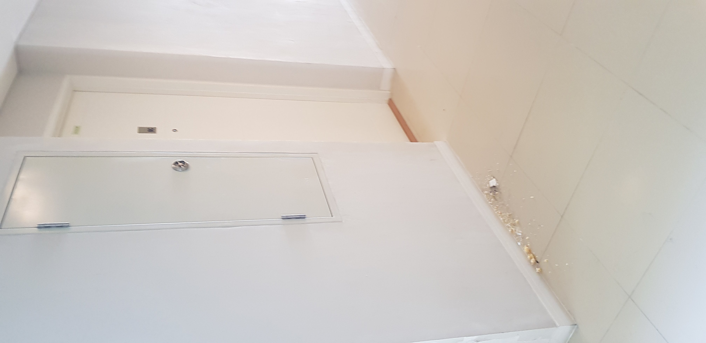
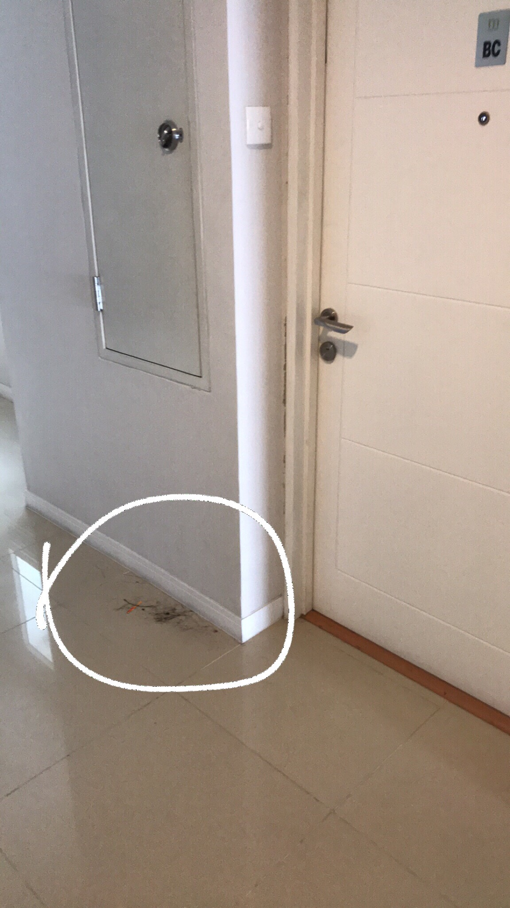
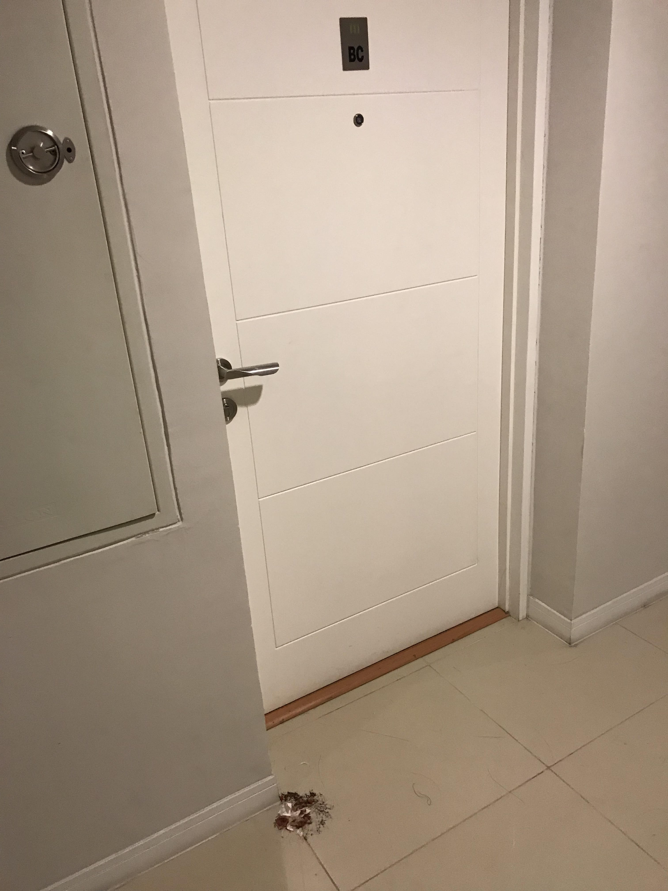
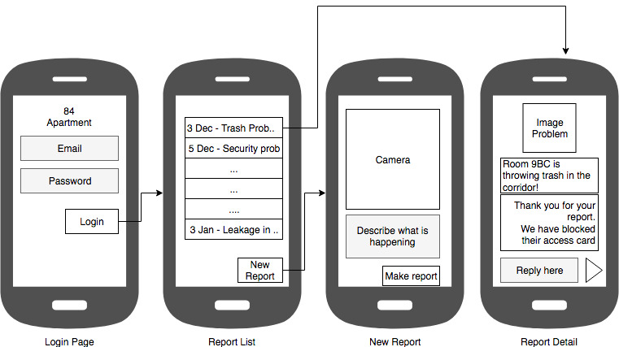

# Apartment '1984' app
---

##  Problem

My apartment has trash problems. People throwing their trash into the shared corridor. Which are lazy, irresponsible, and plain disgusting. 

The problem is exacerbated by the fact that there are non-existent CCTV in the apartment's corridor making observations by the building management hard. People inside the apartment are also busy and may not have time to properly report the problem to the building management.

Exhibit A
 

Exhibit B
 

Exhibit C
 

## Proposed Solution

A Mobile app that allows residence to report problem directly to the building management. This would try to solve the problem of residence not having proper channel or time to make a formal report / complaint to the building management. Moreover, updates on the issue will be updated on the app directly, making follow-ups easy.

#### Application skeleton mockup
 

## Core features:

* Login / Logout (Authentication)
* Problem lists page (refreshable)
* Add new problem with camera integration, and location tag
* Problem detail page to see update on the issue (Refreshable)
* Push Notification on Updated problems
* Change profile

## External service

In order to make this application work there are some external services that the application will need to talk to:

* Apartement's web backend to store / get issue list and authentication
* Google server for sending push notifications and location tagging

## Related work

Application for reporting common problems in a neighbourhood is not new. One prominent example is Qlue app for the Jakarta and some other cities problem. It is directly updated to the related division on the local government. This idea learn from them and tried to apply the lessons learned from them to the apartment settings.

As far as the writer know, no apartments utilize this level of reporting and it is going to be helpful for the apartment residence to be able to report problems directly to the management.

## Work division
* Steven A
   Will work on the login and the problem list page

* Steven B
   Will work on the add new problem page and the problem detail page

## Weekly plan

* Week 5 - Start create skeleton activities
* Week 6 - Design User Interface for each activities
* Week 7 - Handle login network activities, problem listing, add new problem, and detail
* Week 8 - Handle database (Saving problems to local database, adding new problems)
* Week 9 - Camera API
* Week 10 - Handle sensitive data encryption
* Week 11 - User Experience tweak
* Week 12 - Report preparation
* Week 13 - Presentation
